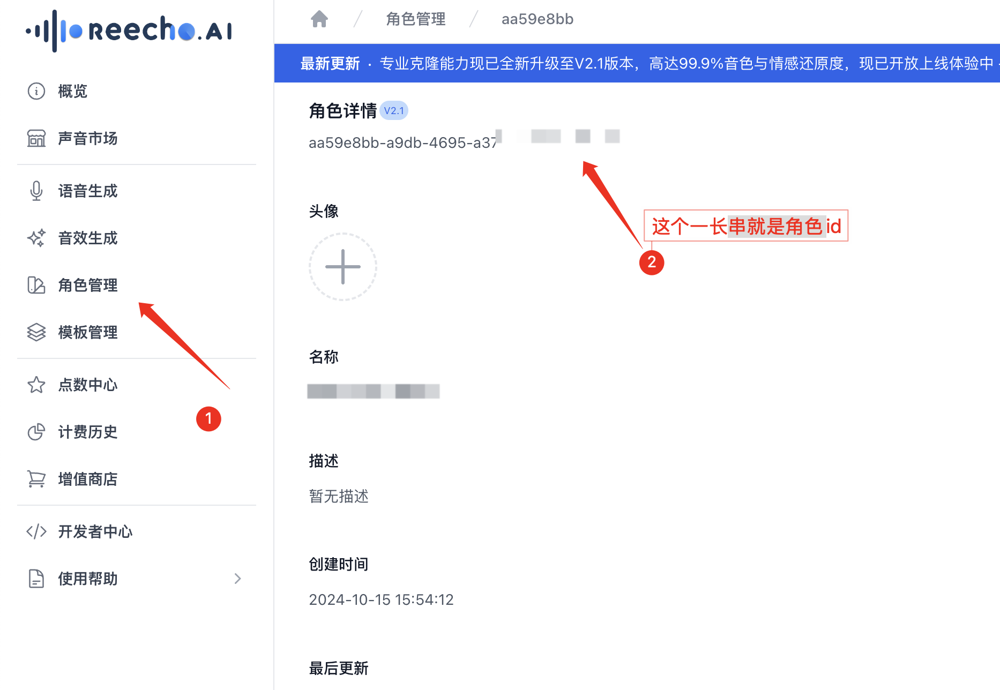
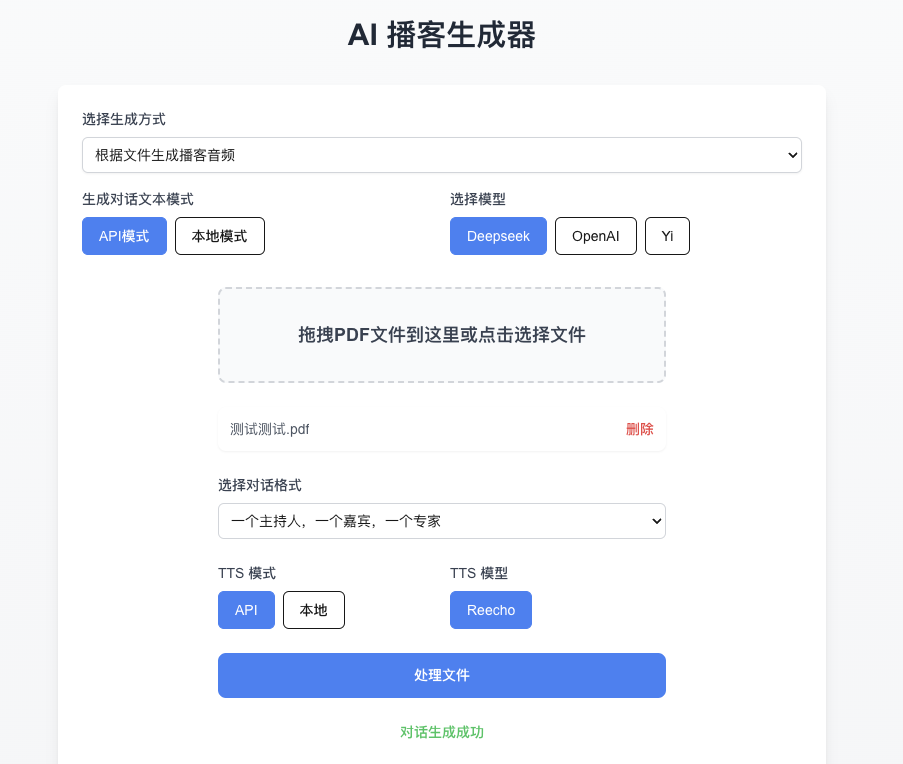
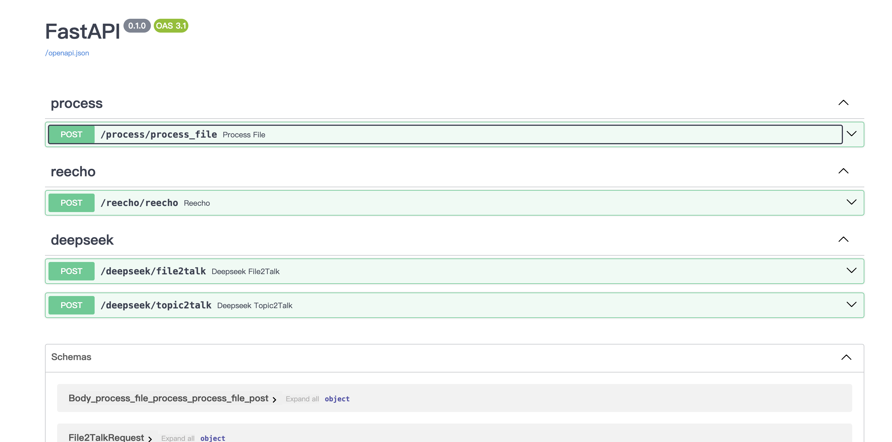

# AutoPodcast - 一个简易的AI播客生成器

<!-- PROJECT SHIELDS -->
[![Contributors][contributors-shield]][contributors-url]
[![Forks][forks-shield]][forks-url]
[![Stargazers][stars-shield]][stars-url]
[![License][license-shield]][license-url]
<!-- PROJECT LOGO -->

- TTS转换接入了`Reecho`的API。
- 对话文本生成使用了`DeepSeek`的大模型来进行生成。
- 文件处理函数使用`PyPDF2`进行处理，直接抽取出了PDF文件的文本，**没有经过其他细致处理！！**。
- 若有其他需要可自行在后端进行修改。


## 开始
**运行项目:**

⚠️ 首次运行项目前，需要在命令行或终端中输入以下命令：
```bash
npm install
```

- 然后输入以下命令启动项目前端：
```bash
npm run dev # 前端
```

- 然后输入以下命令启动项目后端：
```bash
cd backend
uvicorn main:app --reload # 后端
```


在浏览器打开链接 [http://localhost:3000](http://localhost:3000) 在浏览器中查看前端界面。
后端FastAPI文档：默认 http://127.0.0.1:8000/docs


## 使用说明

首次使用前需要自己配置自己的API-KEY以及语音角色的id，配置的文件位于`backend/config.py`，配置完成后记得保存。

- deepseek api申请地址：https://platform.deepseek.com/usage

- reecho api申请地址：https://dash.reecho.cn/apiKey

- reecho 语音角色id获取：



## 页面预览


### 前端

**根据文件生成播客**


生成的文本可自行修改后确认，确认之后会发送到reecho进行TTS转换，转换完成之后可以进行播放和下载


**根据主题生成播客**


### 后端


<!-- links -->
[your-project-path]:Chal1ce/AutoPodcast
[contributors-shield]: https://img.shields.io/github/contributors/Chal1ce/AutoPodcast.svg?style=flat-square
[contributors-url]: https://github.com/Chal1ce/AutoPodcast/graphs/contributors
[forks-shield]: https://img.shields.io/github/forks/Chal1ce/AutoPodcast.svg?style=flat-square
[forks-url]: https://github.com/Chal1ce/AutoPodcast/network/members
[stars-shield]: https://img.shields.io/github/stars/Chal1ce/AutoPodcast.svg?style=flat-square
[stars-url]: https://github.com/Chal1ce/AutoPodcast/stargazers
[issues-shield]: https://img.shields.io/github/issues/Chal1ce/AutoPodcast.svg?style=flat-square
[issues-url]: https://img.shields.io/github/issues/Chal1ce/AutoPodcast.svg
[license-shield]: https://img.shields.io/github/license/Chal1ce/AutoPodcast.svg?style=flat-square
[license-url]: https://github.com/Chal1ce/AutoPodcast/blob/master/LICENSE.txt
[linkedin-shield]: https://img.shields.io/badge/-LinkedIn-black.svg?style=flat-square&logo=linkedin&colorB=555
[linkedin-url]: https://linkedin.com/in/shaojintian
