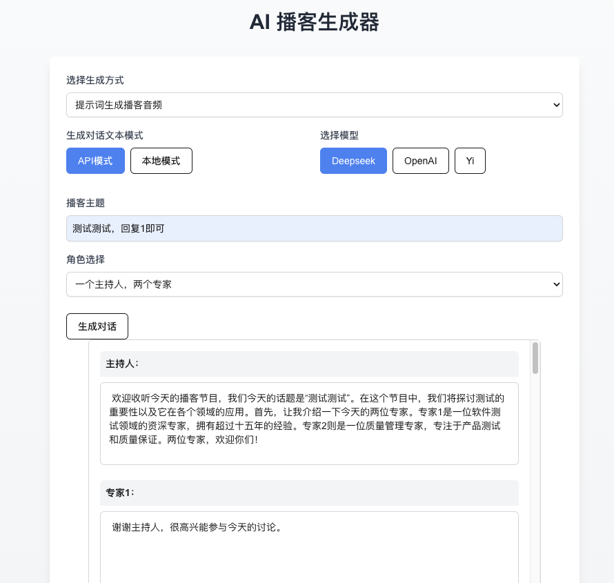

<div align="center">

# AutoPodcast - A Simple AI Podcast Generator

</div>

<!-- PROJECT SHIELDS -->
<div align="center">

[![Contributors][contributors-shield]][contributors-url] [![Forks][forks-shield]][forks-url] [![Stargazers][stars-shield]][stars-url] [![License][license-shield]][license-url]

[中文](README_zh-cn.md) | [English](README_en.md)

</div>
<!-- PROJECT LOGO -->

- TTS conversion has integrated the `Reecho` API, while local mode has integrated `Coqui-TTS`.
- The dialogue text generation model uses APIs from `01`, `openai`, and `deepseek`, with local model interfaces still under development.
- File processing functions utilize `PyPDF` to extract text directly from PDF files, **without any detailed processing!!**.
- Further modifications can be made on the backend as required.

**Under Development**
- Adapting to multiple file types

**Ongoing Optimization**
- Integrating TTS with local models
- Integrating dialogue generation with local models
- File processing

## Getting Started
**To run the project:**

⚠️ Before running the project for the first time, enter the following commands in the command line or terminal:
```bash
npm install
pip install -r requirements.txt
```

- Then enter the following command to start the project frontend:
```bash
npm run dev # frontend
```

- Then enter the following command to start the project backend:
```bash
cd backend
uvicorn main:app --reload # backend
```


Open the link [http://localhost:3000](http://localhost:3000) in your browser to view the frontend interface.
Backend FastAPI documentation: by default at http://127.0.0.1:8000/docs


## Usage Instructions
### For API Mode
Before initial use, configure your own API-KEY and voice role id in the `backend/config.py` file, and remember to save after configuring.

- deepseek API application address: https://platform.deepseek.com/usage

- reecho API application address: https://dash.reecho.cn/apiKey

- Getting reecho voice role id:


### For Local Mode
You need to place the cloned voice role audio file in the `backend` folder, for example, I placed `test.wav` in the `backend` folder, then when configuring config.py, I can choose `test.wav` for `speaker_wav`.

Local language models for dialogue generation can be downloaded from huggingface or Moda community, some models require agreement to official terms or an application for download at the first download.


## Page Previews


### Frontend

**Generate a podcast from a file**


The generated text can be modified before confirmation, after which it will be sent to reecho for TTS conversion, followed by playback and download options.


**Generate a podcast based on a theme**



### Backend


<!-- links -->
[your-project-path]:Chal1ce/AutoPodcast
[contributors-shield]: https://img.shields.io/github/contributors/Chal1ce/AutoPodcast.svg?style=flat-square
[contributors-url]: https://github.com/Chal1ce/AutoPodcast/graphs/contributors
[forks-shield]: https://img.shields.io/github/forks/Chal1ce/AutoPodcast.svg?style=flat-square
[forks-url]: https://github.com/Chal1ce/AutoPodcast/network/members
[stars-shield]: https://img.shields.io/github/stars/Chal1ce/AutoPodcast.svg?style=flat-square
[stars-url]: https://github.com/Chal1ce/AutoPodcast/stargazers
[license-shield]: https://img.shields.io/github/license/Chal1ce/AutoPodcast.svg?style=flat-square
[license-url]: https://github.com/Chal1ce/AutoPodcast/blob/main/LICENSE